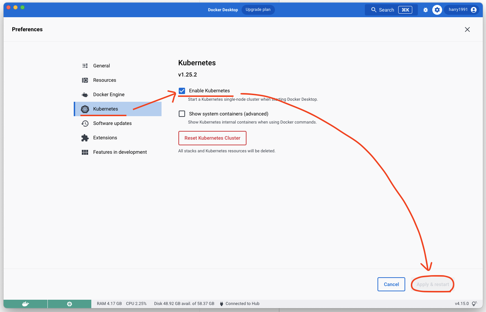

# Kubernetes

## Install on MacOS
docker desktop 에서 아래 이미지 대로 실행

## Install on Linux

1. [minikube docs](https://minikube.sigs.k8s.io/docs/start/)를 확인하여 minikube install
2. `minikube start` 로 클러스터 설치 & 시작
3. [kubernetes docs](https://kubernetes.io/docs/tasks/tools/install-kubectl-linux/)를 확인하여 kubectl install

